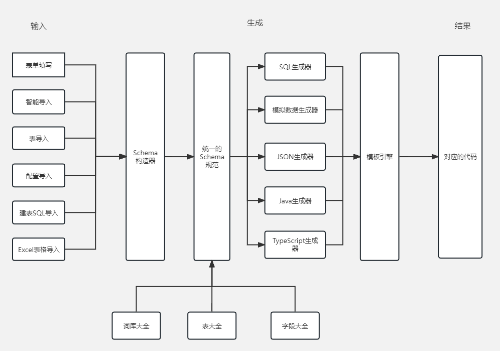
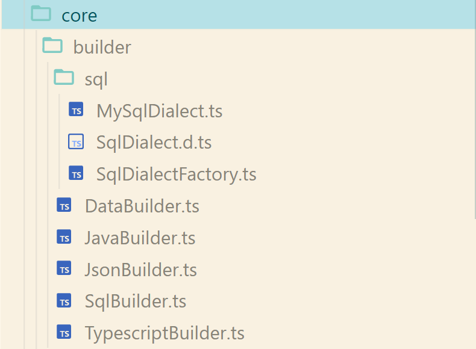
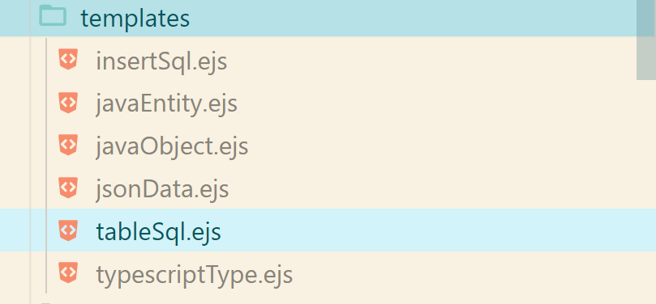
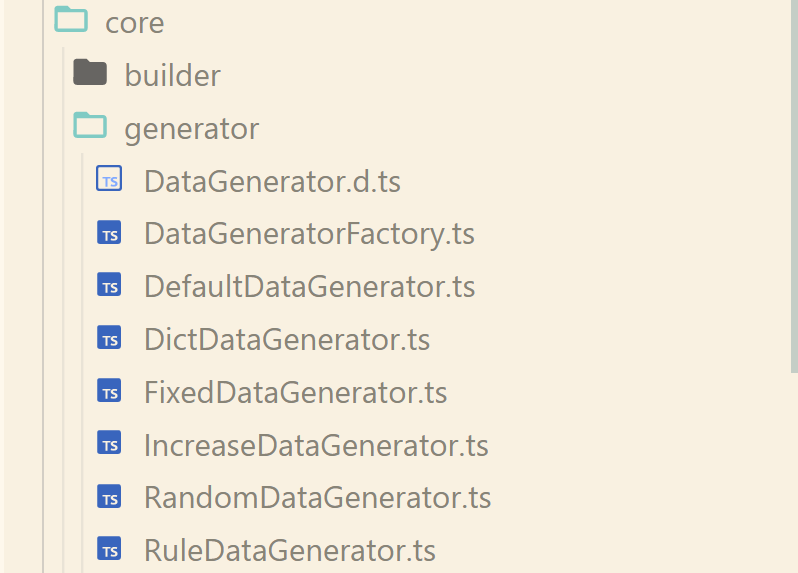
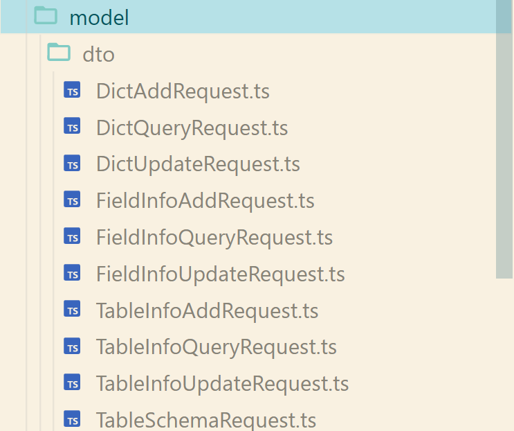

# SQLGenerator - 模拟数据生成器（前端）

> 快速生成 SQL 和模拟数据，大幅提高开发测试的效率！
>
> 本项目模仿程序员鱼皮的 SQLFather，仅作为学习使用。

前端代码仓库：https://gitee.com/litaosheng/sql-generator-front

后端代码仓库：https://gitee.com/litaosheng/sql-generator-backend

# 功能大全

## 用户前台

- 可视化建表
- 快捷导入建表
  - 智能导入
  - 导入表
  - 导入配置
  - 导入建表 SQL
  - 导入 Excel
- 一键生成
  - SQL 建表、插入数据语句
  - 模拟数据
  - JSON 数据
  - Java 代码
  - 前端代码
- 多种模拟数据生成规则
  - 固定值
  - 随机值
  - 正则表达式
  - 递增
  - 定制词库
- 词库共享
  - 创建词库
  - 词库继承
  - 一键创建字典表
  - 根据词库生成模拟数据
- 表信息共享
  - 创建表信息
  - 一键复制建表语句
  - 一键导入表
- 字段共享
  - 创建字段
  - 一键复制创建字段语句
  - 一键导入字段

## 管理后台

- 用户管理
- 词库管理
- 表信息管理
- 字段信息管理

# 技术栈

## 前端

主要技术：

- React 18
- Umi 4.x
- Ant Design 4.x： 组件库
- Ant Design Pro Components： 高级组件
- TypeScript： 类型控制
- Eslint： 代码规范控制
- Prettier： 美化代码

依赖库：

- monaco-editor： 代码编辑器
- copy-to-clipboard： 剪切板复制

## 后端

主要技术：

- Nodejs
- Koa
- Egg
- Midway 3.x
- Sequelize： 用于操作数据库的 ORM 框架
- MySQL： 数据库
- TypeScript： 类型控制

依赖库：

- Faker： 生成模拟数据
- EJS： 模板引擎
- NodeSQLParser： SQL解析
- NodeXlsx： 用于生成 excel 表格和解析 excel 表格
- Casbin： 角色鉴权
- Joi： 参数校验

# 快速启动

> 运行前请确认 node 的版本是大于等于 16.x 的，否则可能会报错。

## 前端

安装依赖：

```
pnpm i
```

运行：

```
pnpm run dev
```

## 后端

> 1、运行 sql 目录下的 create_table.sql 建表
>
> 2、在 src/config/config.default.ts 文件中的 sequelize 配置项中确认 mysql 的用户名跟密码

安装依赖：

```
npm i
```

运行：

```
npm run dev
```

# 系统设计

## 整体架构设计

核心的设计理念，将各种输入方式统一为一个 Schema 规范，并根据 Schema 规范生成建表SQL、模拟数据、JSON数据、Java代码、TypeScript代码。

架构设计图如下：

!](./../../browser/chrome/SQLGenerator.png)

核心模块可以分为一下几个：

1、Schema 构造器：将不同的输入方式转化为统一的 Schema 规范定义

2、统一 Schema 定义：本质就是一个 class 类，同于保存表格字段信息

3、生成器：负责根据 Schema 生成数据以及代码

4、共享服务：包括词库大全、表大全、字段大全，可以在他们原有的基础上进行一键导入其中的数据，进行快速生成数据以及代码

> 核心的模块都在后端代码中的core目录下

## Schema 构造器

核心类：`src/core/schema/TableSchemaBuilder.ts`，作用就是将不同的参数收敛为 TableSchema 对象。

其中的`buildFromSql()`方法，作用是解析前端传递过来的建表 sql 语句，使用了 node-sql-parser 包进行解析，其实现的原理就是利用了AST语法树，将建表sql与其中定义好的关键字进行作比较，最终将建表sql中的语句拆解成以树状形式表示的层级结构，最后在其结构中提取出需要用的词，转成一个 TableSchema 对象返回。

## Schema 定义

用于保存表和字段信息，结构如下：

```json
{
  "dbName": "库名",
  "tableName": "test_table",
  "tableComment": "表注释",
  "mockNum": 20,
  "fieldList": [{
    "fieldName": "username",
    "comment": "用户名",
    "fieldType": "varchar(256)",
    "mockType": "随机",
    "mockParams": "人名",
    "notNull": true,
    "primaryKey": false,
    "autoIncrement": false
  }]
}
```

## 生成器

### 多种生成类型

将每种生成类型定义为一个 Builder （core/builder目录），如下图所示：



其中，对于 SQL 代码生成器（SqlBuilder），使用方言来支持不同的数据库类型（策略模式），并使用单例模式+工厂模式创建方言实例

对于建表SQL、SQL插入语句、Java代码、Json数据、TypeScript代码的生成，使用EJS模板引擎来生成，各个模板代码放在`src/templates`目录下，如下图所示：



### 多种模拟数据生成规则

每中生成规则都定义为一个 Generator ，使用 DataGeneratorFactory（工厂模式）对多个 Generator 实例（单例模式）进行统一的创建以及管理。在`src/core/generator`目录下，如下图所示：



使用 Faker 进行随机数据的模拟生成（RandomDataGenerator）

使用 RandExp 进行正则表达式的匹配以及生成对应的数据字符串（RuleDataGenerator）

### 参数校验

在控制器（controller）中获取的参数都要进行进行校验，在 midway 中其提供了 @midwayjs/validate 帮我们基于 joi 进行了封装，可以让我们使用起来更加的简单，其中的校验规则放在了目录`src/model/dto`下，如下图所示：



## 共享服务

共享服务包括词库、表信息、字段信息共享，本质就是对这些实体进行CRUD

# 学习笔记

我的学习笔记放置在`StudyNote.md`下，感兴趣的小伙伴可以前去查看。


